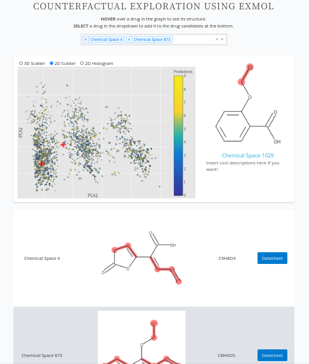

# Dash for exmol

## About this app

This is an app to visualize the counterfactual chemical space generated by [exmol](https://github.com/ur-whitelab/exmol) using dash template avaiable below. Minor modifications were made to the template to allow interactive display of the counterfactuals. 

Original repo: [plotly/dash-drug-discovery-demo](https://github.com/plotly/dash-sample-apps/tree/main/apps/dashr-drug-discovery)


## How to run this app

First, clone this repository and open a terminal inside the folder. 


Install the requirements:

```bash

pip install -r requirements.txt
```

Generate chemical space of counterfactuals using [generate_counterfactuals.ipynb](app/generate_counterfactuals.ipynb). Note that the data (name of the columns) and axis label for x, y and z dimentions are hard coded and thus app.py and helpers.py need to be edited. 

Run the app:

```bash
python app.py
```
Open a browser at http://127.0.0.1:8050

## Screenshots



## Resources

- To learn more about Dash, check out our [documentation](https://plot.ly/dash).
